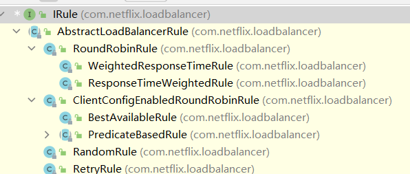

# 微服务


## 服务注册中心Eureka


* 注册中心

注册中心在微服务项目中扮演着非常重要的角色，是微服务架构中的纽带，类似于`通讯录`，它记录了服务和服务地址的映射关系。在分布式架构中，服务会注册到这里，当服务需要调用其它服务时，就到这里找到服务的地址，进行调用。

* 为什么要是用注册中心

注册中心解决了`服务发现`的问题。在没有注册中心时候，服务间调用需要知道被调方的地址或者代理地址。当服务更换部署地址，就不得不修改调用当中指定的地址或者修改代理配置。而有了注册中心之后，每个服务在调用别人的时候只需要知道服务名称就好，继续地址都会通过注册中心同步过来。


### 1. 加入maven依赖

必须保持版本一致，不然各种bug全部来。。。


* 父工程依赖

```xml
<properties>
        <java.version>1.8</java.version>
        <project.build.sourceEncoding>UTF-8</project.build.sourceEncoding>
        <maven.compiler.source>1.8</maven.compiler.source>
        <maven.compiler.target>1.8</maven.compiler.target>
        <junit.version>4.12</junit.version>
        <log4j.version>1.2.17</log4j.version>
        <lombok.version>1.18.24</lombok.version>
        <mysql.version>8.0.29</mysql.version>
        <druid.version>1.1.16</druid.version>
        <mybatis.spring.boot.version>1.3.0</mybatis.spring.boot.version>
    </properties>

<dependencyManagement>
    <dependencies>
        <dependency>
            <groupId>org.springframework.boot</groupId>
            <artifactId>spring-boot-dependencies</artifactId>
            <version>2.2.2.RELEASE</version>
            <type>pom</type>
            <scope>import</scope>
        </dependency>

        <dependency>
            <groupId>org.springframework.cloud</groupId>
            <artifactId>spring-cloud-dependencies</artifactId>
            <version>Hoxton.RELEASE</version>
            <type>pom</type>
            <scope>import</scope>
        </dependency>
        <dependency>
            <groupId>mysql</groupId>
            <artifactId>mysql-connector-java</artifactId>
            <version>${mysql.version}</version>
        </dependency>
        <dependency>
            <groupId>log4j</groupId>
            <artifactId>log4j</artifactId>
            <version>${log4j.version}</version>
        </dependency>
        <dependency>
            <groupId>org.projectlombok</groupId>
            <artifactId>lombok</artifactId>
            <version>${lombok.version}</version>
        </dependency>
        <dependency>
            <groupId>com.alibaba</groupId>
            <artifactId>druid-spring-boot-starter</artifactId>
            <version>${druid.version}</version>
        </dependency>
        <dependency>
            <groupId>org.mybatis.spring.boot</groupId>
            <artifactId>mybatis-spring-boot-starter</artifactId>
            <version>${mybatis.spring.boot.version}</version>
        </dependency>
    </dependencies>
</dependencyManagement>
```


* Eureka服务端pom文件

```xml
<dependencies>
    <dependency>
        <groupId>org.springframework.cloud</groupId>
        <artifactId>spring-cloud-starter-netflix-eureka-server</artifactId>
    </dependency>
    <dependency>
        <groupId>org.springframework.boot</groupId>
        <artifactId>spring-boot-starter-actuator</artifactId>
    </dependency>
    <dependency>
        <groupId>org.springframework.boot</groupId>
        <artifactId>spring-boot-starter-web</artifactId>
    </dependency>
    <dependency>
        <groupId>org.projectlombok</groupId>
        <artifactId>lombok</artifactId>
    </dependency>
    <dependency>
        <groupId>org.springframework.boot</groupId>
        <artifactId>spring-boot-starter-test</artifactId>
    </dependency>
</dependencies>
```

* Eureka客户端pom文件

```xml
<dependencies>
    <dependency>
        <groupId>com.dajiao</groupId>
        <artifactId>common</artifactId>
        <version>0.0.1-SNAPSHOT</version>
    </dependency>
    <dependency>
        <groupId>org.springframework.cloud</groupId>
        <artifactId>spring-cloud-starter-netflix-eureka-client</artifactId>
    </dependency>
    <dependency>
        <groupId>org.springframework.boot</groupId>
        <artifactId>spring-boot-starter-web</artifactId>
    </dependency>
    <dependency>
        <groupId>org.springframework.boot</groupId>
        <artifactId>spring-boot-starter-actuator</artifactId>
    </dependency>
</dependencies>
```


### 2. yml配置

* 服务端

```yml
server:
  port: 7001

eureka:
  instance:
    hostname: localhost #配置eureka的域名
  client:
    register-with-eureka: false  # 是否向eureka中心注册自己，默认为true
    fetch-registry: false # 是否向eureka中心抓取注册信息，默认为true
    service-url:
      defaultZone: http://${eureka.instance.hostname}:${server.port}/eureka/ # 连接的eureka，单机状态下服务端自连接
```


* 客户端

``` yml
server:
  port: 8001

spring:
  application:
    name: payment #服务的名称，必须项
    
eureka:
  client:
    register-with-eureka: true # 是否连接eureka
    fetch-registry: true #是否抓取注册信息
    service-url:
      defaultZone: http://localhost:7001/eureka # 连接的eureka地址
```


### 3. 启动类

* 服务端

```java
/**
 * @author: Mr.Yu
 * @create: 2022-07-02 15:47
 **/
@EnableEurekaServer //开启eureka服务端注解，必须项
@SpringBootApplication
public class EurekaServerApplication {

    public static void main(String[] args) {
        SpringApplication.run(EurekaServerApplication.class, args);
    }
}
```


* 客户端，（具体服务）

```java
/**
 * @author: Mr.Yu
 * @create: 2022-07-02 16:12
 **/
@EnableEurekaClient
@SpringBootApplication
@MapperScan("com.dajiao.service")
public class PaymentApplication {

    public static void main(String[] args) {
        SpringApplication.run(PaymentApplication.class, args);
    }
}
```


### 4. 访问

直接在浏览器下访问：http://localhost:7001/ 即可


### 5. Eureka集群

只需修改eureka服务端的yml文件即可

* `eureka7001:7001`地址的eureka配置

```yml
eureka:
  instance:
    hostname: eureka7001.com #配置eureka的域名
  client:
    register-with-eureka: false  # 是否向eureka中心注册自己，默认为true
    fetch-registry: false # 是否向eureka中心抓取注册信息，默认为true
    service-url:
      defaultZone: http://eureka7002.com:7002/eureka/ #指向其他的eureka服务端，这样服务端之间就可以互连，达到互相通信的目的
```

* `eureka7002:7002`地址的eureka配置

```yml
eureka:
  instance:
    hostname: eureka7002.com #配置eureka的域名
  client:
    register-with-eureka: false  # 是否向eureka中心注册自己，默认为true
    fetch-registry: false # 是否向eureka中心抓取注册信息，默认为true
    service-url:
      defaultZone: http://eureka7001.com:7001/eureka/ #指向其他的eureka服务端，这样服务端之间就可以互连，达到互相通信的目的
```

* 客户端配置

```yml
eureka:
  client:
    register-with-eureka: true
    fetch-registry: true
    service-url:
      defaultZone: http://eureka7001.com:7001/eureka,http://eureka7002.com:7002/eureka
```


### 6. actuator微服务信息完善

在客户端的yml下配置

```yml
eureka:
  instance:
    instance-id: payment8001 #设置此项之后，eureka服务端显示status时，就会显示payment8001
    prefer-ip-address: true # 在网页查看客户端状态时，可以查看客户端的ip地址
  client:
    register-with-eureka: true
    fetch-registry: true
    service-url:
      defaultZone: http://eureka7001.com:7001/eureka
```


### 7. 关闭eureka的自我保护

只需要在服务端的yml下配置

```yml
eureka:
  instance:
    hostname: localhost
  client:
    register-with-eureka: false
    fetch-registry: false
    service-url:
      defaultZone: http://eureka7001.com:7001/eureka/
  server:
    enable-self-preservation: true # 关闭自我保护，当客户端在指定的心跳时间内没有和服务端连接，就会被服务端剔除出服务中心
    eviction-interval-timer-in-ms: 10000 # 这是在相应时间内没有心跳连接后eureka服务端的等待时间，在10s后，这些客户端就会被剔除
```


## 服务调用负载均衡Ribbon


### 1. maven依赖

当加入了eureka之后，自动依赖了ribbon


### 2. 如何使用

在客户服务中获取RestTemplate实例，在RestTemplate实例获取时加上@LoadBalanced注解，即使用了Ribbon的负载均衡

``` java
/**
 * @author: Mr.Yu
 * @create: 2022-07-02 21:15
 **/
@Configuration
public class RestConfig {

    @Bean
    @LoadBalanced
    public RestTemplate restTemplate() {
        return new RestTemplate();
    }
}
```


在调用服务时，可以使用RestTemplate的`getForObject(url,RespBean.class)`或者是`postForObject(url,Object参数,RespBean.class)`调用；

```java
@RestController
public class UserServiceRevoke {

    @Autowired
    RestTemplate restTemplate;

    // url就是http+服务名+具体的接口路径
    public static final String url = "http://PAYMENT";

    @GetMapping("/user/{id}")
    public RespBean revoke(@PathVariable("id") Integer id) {
        return restTemplate.getForObject(url+"/user/"+id, RespBean.class);
    }
}
```


### 3. Ribbon的负载均衡策略



ribbon的默认策略是轮询

```java
public class RoundRobinRule extends AbstractLoadBalancerRule {
    private AtomicInteger nextServerCyclicCounter;
    private static final boolean AVAILABLE_ONLY_SERVERS = true;
    private static final boolean ALL_SERVERS = false;
    private static Logger log = LoggerFactory.getLogger(RoundRobinRule.class);

    public RoundRobinRule() {
        this.nextServerCyclicCounter = new AtomicInteger(0);
    }

    public RoundRobinRule(ILoadBalancer lb) {
        this();
        this.setLoadBalancer(lb);
    }

    public Server choose(ILoadBalancer lb, Object key) {
        if (lb == null) {
            log.warn("no load balancer");
            return null;
        } else {
            Server server = null;
            int count = 0;

            while(true) {
                if (server == null && count++ < 10) {
                    // 获取可达的服务list
                    List<Server> reachableServers = lb.getReachableServers();
                    // 获取所有服务
                    List<Server> allServers = lb.getAllServers();
                    int upCount = reachableServers.size();
                    int serverCount = allServers.size();
                    // 如果可达的服务和所有的服务均不为0，进入轮询
                    if (upCount != 0 && serverCount != 0) {
                        // 自旋轮询
                        int nextServerIndex = this.incrementAndGetModulo(serverCount);
                        // 获取服务
                        server = (Server)allServers.get(nextServerIndex);
                        // 猜想该服务可能被别的线程删除，因为穿进去的参数serverCount是自旋之前的
                        if (server == null) {
                            Thread.yield();
                        } else {
                            // 服务可用，且准备好，返回服务
                            if (server.isAlive() && server.isReadyToServe()) {
                                return server;
                            }

                            server = null;
                        }
                        continue;
                    }

                    log.warn("No up servers available from load balancer: " + lb);
                    return null;
                }

                if (count >= 10) {
                    log.warn("No available alive servers after 10 tries from load balancer: " + lb);
                }

                return server;
            }
        }
    }

    private int incrementAndGetModulo(int modulo) {
        int current;
        int next;
        do {
            // 获取当前的请求次数
            current = this.nextServerCyclicCounter.get();
            // 取余求得返回的服务下标
            next = (current + 1) % modulo;
            // 如果cas成功，代表当前线程是第一个获取到next服务下标的，失败则自旋
        } while(!this.nextServerCyclicCounter.compareAndSet(current, next));

        return next;
    }
}
```


### 4. 改变Ribbon的默认策略

在springboot工程下，新创建一个springboot扫描不到的包，自定义配置类即可，让springboot扫描不到的作用是只有该客户端使用配置的算法，其他客户端还是使用默认的或者是自己配置的。若springboot扫描到了此配置类，会同步到其他客户端服务。

```java
/**
 * @author: Mr.Yu
 * @create: 2022-07-03 15:18
 **/
@Configuration
public class RibbonRule {

    @Bean
    public IRule getRule() {
        return new RandomRule();
    }
}
```

