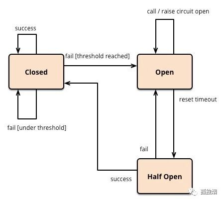

# 微服务


## 单体架构

### 单体架构的优点

* 所有模块都在同一个进程内互相调用，不用考虑网络分区，数据一致性等复杂的事
* 模块之间调用简单，高效

### 单体架构的劣势

* 所有功能都在一个进程中，如果任何一份代码出现了缺陷，大量消耗进程的资源，造成的影响就是全局性的，不可分离的


单体架构本身是一种非常优秀，简洁的模式，就像一个公司只有几十个人，很少会分布在全世界各个地方来进行工作，因为无论是在工作量上还是在成本上，都不值得这样做。当然公司有几万人的规模，业务方面肯定遍布各地，需要进行分离。所以单体架构向微服务架构演变是由于单体的计算机硬件方面总有瓶颈，并且软件规模已经到达了一定程度后需要向微服务方向转变，使软件的开发，测试，部署等更加容易。


### CAP理论

* Partition tolerance：分区容错性

分区是指分布式系统中的子网络，例如阿里巴巴可能在广州和杭州各自构建服务，两个地方的网络构成了不同的分区。当某一个分区不能通信的时候，整个系统应该保持对外提供服务的能力。

* consistent：一致性

一致性是指在分布式系统中每个节点的数据都是一致的，不能出现a节点的账户是1000，b节点的账户是2000的情况

* availability：可用性

可用性是指每个节点在收到请求后，必须返回数据


由于网络是不可靠的，所以分区之间出现失联是不可避免的，如果不满足分区容错性的话，即出现失联就停掉整个分布式系统，那还不如使用单体架构。所以CAP中的P是必须要满足的。


* 为什么C和A不能同时满足呢？

如果系统需要满足系统一致性，那么就必须在节点之间同步数据，a节点收到修改某数据的请求之后，需要将此数据同步给b节点，此时b节点就不应该对外提供该数据的读写操作，不然就满足不了一致性。那如果限制了读写操作，势必造成了可用性不能满足！


* 个人认为在正常环境下，C和A是可以存在的

因为如果数据量少，网络无阻塞，数据同步是很快的，那么可用性只要在数据同步的时间之外都是满足的，一般情况下C和A是可以同时存在的。


### base理论


base单词是由Basically available，soft state，eventually consistent三个词语组成的

* Basically available：基本可用

  **响应时间上的损失**：正常情况下的搜索引擎0.5秒即返回给用户结果，而基本可用的搜索引擎可以在2秒作用返回结果。

  **功能上的损失**：在一个电商网站上，正常情况下，用户可以顺利完成每一笔订单。但是到了大促期间，为了保护购物系统的稳定性，部分消费者可能会被引导到一个降级页面。

  

* soft state

  软状态相对原子性来说各个要求都有所降低，原子性（硬状态），要求多个节点的数据副本都是一致的,这是一种"硬状态"。软状态（弱状态）允许系统中的数据存在中间状态,并认为该状态不影响系统的整体可用性,即允许系统在多个不同节点的数据副本存在数据延迟

* eventually consistent

  最终一致性，一致性也分强一致性和弱一致性，而最终一致性属于弱一致性，就是系统并不保证连续进程或者线程的访问都会返回最新的更新过的值。系统在数据写入成功之后，不承诺立即可以读到最新写入的值，也不会具体的承诺多久之后可以读到。但会尽可能保证在某个时间级别（比如秒级别）之后，可以让数据达到一致性状态。


## 分布式事务

### 两阶段提交


### 三阶段提交


### 可靠消息队列


### TCC


### Saga


## 服务注册中心Eureka


* 注册中心

注册中心在微服务项目中扮演着非常重要的角色，是微服务架构中的纽带，类似于`通讯录`，它记录了服务和服务地址的映射关系。在分布式架构中，服务会注册到这里，当服务需要调用其它服务时，就到这里找到服务的地址，进行调用。

* 为什么要是用注册中心

注册中心解决了`服务发现`的问题。在没有注册中心时候，服务间调用需要知道被调方的地址或者代理地址。当服务更换部署地址，就不得不修改调用当中指定的地址或者修改代理配置。而有了注册中心之后，每个服务在调用别人的时候只需要知道服务名称就好，继续地址都会通过注册中心同步过来。


### 1. 加入maven依赖

必须保持版本一致，不然各种bug全部来。。。


* 父工程依赖

```xml
<properties>
        <java.version>1.8</java.version>
        <project.build.sourceEncoding>UTF-8</project.build.sourceEncoding>
        <maven.compiler.source>1.8</maven.compiler.source>
        <maven.compiler.target>1.8</maven.compiler.target>
        <junit.version>4.12</junit.version>
        <log4j.version>1.2.17</log4j.version>
        <lombok.version>1.18.24</lombok.version>
        <mysql.version>8.0.29</mysql.version>
        <druid.version>1.1.16</druid.version>
        <mybatis.spring.boot.version>1.3.0</mybatis.spring.boot.version>
    </properties>

<dependencyManagement>
    <dependencies>
        <dependency>
            <groupId>org.springframework.boot</groupId>
            <artifactId>spring-boot-dependencies</artifactId>
            <version>2.2.2.RELEASE</version>
            <type>pom</type>
            <scope>import</scope>
        </dependency>

        <dependency>
            <groupId>org.springframework.cloud</groupId>
            <artifactId>spring-cloud-dependencies</artifactId>
            <version>Hoxton.RELEASE</version>
            <type>pom</type>
            <scope>import</scope>
        </dependency>
        <dependency>
            <groupId>mysql</groupId>
            <artifactId>mysql-connector-java</artifactId>
            <version>${mysql.version}</version>
        </dependency>
        <dependency>
            <groupId>log4j</groupId>
            <artifactId>log4j</artifactId>
            <version>${log4j.version}</version>
        </dependency>
        <dependency>
            <groupId>org.projectlombok</groupId>
            <artifactId>lombok</artifactId>
            <version>${lombok.version}</version>
        </dependency>
        <dependency>
            <groupId>com.alibaba</groupId>
            <artifactId>druid-spring-boot-starter</artifactId>
            <version>${druid.version}</version>
        </dependency>
        <dependency>
            <groupId>org.mybatis.spring.boot</groupId>
            <artifactId>mybatis-spring-boot-starter</artifactId>
            <version>${mybatis.spring.boot.version}</version>
        </dependency>
    </dependencies>
</dependencyManagement>
```


* Eureka服务端pom文件

```xml
<dependencies>
    <dependency>
        <groupId>org.springframework.cloud</groupId>
        <artifactId>spring-cloud-starter-netflix-eureka-server</artifactId>
    </dependency>
    <dependency>
        <groupId>org.springframework.boot</groupId>
        <artifactId>spring-boot-starter-actuator</artifactId>
    </dependency>
    <dependency>
        <groupId>org.springframework.boot</groupId>
        <artifactId>spring-boot-starter-web</artifactId>
    </dependency>
    <dependency>
        <groupId>org.projectlombok</groupId>
        <artifactId>lombok</artifactId>
    </dependency>
    <dependency>
        <groupId>org.springframework.boot</groupId>
        <artifactId>spring-boot-starter-test</artifactId>
    </dependency>
</dependencies>
```

* Eureka客户端pom文件

```xml
<dependencies>
    <dependency>
        <groupId>com.dajiao</groupId>
        <artifactId>common</artifactId>
        <version>0.0.1-SNAPSHOT</version>
    </dependency>
    <dependency>
        <groupId>org.springframework.cloud</groupId>
        <artifactId>spring-cloud-starter-netflix-eureka-client</artifactId>
    </dependency>
    <dependency>
        <groupId>org.springframework.boot</groupId>
        <artifactId>spring-boot-starter-web</artifactId>
    </dependency>
    <dependency>
        <groupId>org.springframework.boot</groupId>
        <artifactId>spring-boot-starter-actuator</artifactId>
    </dependency>
</dependencies>
```


### 2. yml配置

* 服务端

```yml
server:
  port: 7001

eureka:
  instance:
    hostname: localhost #配置eureka的域名
  client:
    register-with-eureka: false  # 是否向eureka中心注册自己，默认为true
    fetch-registry: false # 是否向eureka中心抓取注册信息，默认为true
    service-url:
      defaultZone: http://${eureka.instance.hostname}:${server.port}/eureka/ # 连接的eureka，单机状态下服务端自连接
```


* 客户端

``` yml
server:
  port: 8001

spring:
  application:
    name: payment #服务的名称，必须项
    
eureka:
  client:
    register-with-eureka: true # 是否连接eureka
    fetch-registry: true #是否抓取注册信息
    service-url:
      defaultZone: http://localhost:7001/eureka # 连接的eureka地址
```


### 3. 启动类

* 服务端

```java
/**
 * @author: Mr.Yu
 * @create: 2022-07-02 15:47
 **/
@EnableEurekaServer //开启eureka服务端注解，必须项
@SpringBootApplication
public class EurekaServerApplication {

    public static void main(String[] args) {
        SpringApplication.run(EurekaServerApplication.class, args);
    }
}
```


* 客户端，（具体服务）

```java
/**
 * @author: Mr.Yu
 * @create: 2022-07-02 16:12
 **/
@EnableEurekaClient
@SpringBootApplication
@MapperScan("com.dajiao.service")
public class PaymentApplication {

    public static void main(String[] args) {
        SpringApplication.run(PaymentApplication.class, args);
    }
}
```


### 4. 访问

直接在浏览器下访问：http://localhost:7001/ 即可


### 5. Eureka集群

只需修改eureka服务端的yml文件即可

* `eureka7001:7001`地址的eureka配置

```yml
eureka:
  instance:
    hostname: eureka7001.com #配置eureka的域名
  client:
    register-with-eureka: false  # 是否向eureka中心注册自己，默认为true
    fetch-registry: false # 是否向eureka中心抓取注册信息，默认为true
    service-url:
      defaultZone: http://eureka7002.com:7002/eureka/ #指向其他的eureka服务端，这样服务端之间就可以互连，达到互相通信的目的
```

* `eureka7002:7002`地址的eureka配置

```yml
eureka:
  instance:
    hostname: eureka7002.com #配置eureka的域名
  client:
    register-with-eureka: false  # 是否向eureka中心注册自己，默认为true
    fetch-registry: false # 是否向eureka中心抓取注册信息，默认为true
    service-url:
      defaultZone: http://eureka7001.com:7001/eureka/ #指向其他的eureka服务端，这样服务端之间就可以互连，达到互相通信的目的
```

* 客户端配置

```yml
eureka:
  client:
    register-with-eureka: true
    fetch-registry: true
    service-url:
      defaultZone: http://eureka7001.com:7001/eureka,http://eureka7002.com:7002/eureka
```


### 6. actuator微服务信息完善

在客户端的yml下配置

```yml
eureka:
  instance:
    instance-id: payment8001 #设置此项之后，eureka服务端显示status时，就会显示payment8001
    prefer-ip-address: true # 在网页查看客户端状态时，可以查看客户端的ip地址
  client:
    register-with-eureka: true
    fetch-registry: true
    service-url:
      defaultZone: http://eureka7001.com:7001/eureka
```


### 7. 关闭eureka的自我保护

只需要在服务端的yml下配置

```yml
eureka:
  instance:
    hostname: localhost
  client:
    register-with-eureka: false
    fetch-registry: false
    service-url:
      defaultZone: http://eureka7001.com:7001/eureka/
  server:
    enable-self-preservation: true # 关闭自我保护，当客户端在指定的心跳时间内没有和服务端连接，就会被服务端剔除出服务中心
    eviction-interval-timer-in-ms: 10000 # 这是在相应时间内没有心跳连接后eureka服务端的等待时间，在10s后，这些客户端就会被剔除
```


## 服务调用负载均衡Ribbon


### 1. maven依赖

当加入了eureka之后，自动依赖了ribbon


### 2. 如何使用

在客户服务中获取RestTemplate实例，在RestTemplate实例获取时加上@LoadBalanced注解，即使用了Ribbon的负载均衡

``` java
/**
 * @author: Mr.Yu
 * @create: 2022-07-02 21:15
 **/
@Configuration
public class RestConfig {

    @Bean
    @LoadBalanced
    public RestTemplate restTemplate() {
        return new RestTemplate();
    }
}
```


在调用服务时，可以使用RestTemplate的`getForObject(url,RespBean.class)`或者是`postForObject(url,Object参数,RespBean.class)`调用；

```java
@RestController
public class UserServiceRevoke {

    @Autowired
    RestTemplate restTemplate;

    // url就是http+服务名+具体的接口路径
    public static final String url = "http://PAYMENT";

    @GetMapping("/user/{id}")
    public RespBean revoke(@PathVariable("id") Integer id) {
        return restTemplate.getForObject(url+"/user/"+id, RespBean.class);
    }
}
```


### 3. Ribbon的负载均衡策略


ribbon的默认策略是轮询

```java
public class RoundRobinRule extends AbstractLoadBalancerRule {
    private AtomicInteger nextServerCyclicCounter;
    private static final boolean AVAILABLE_ONLY_SERVERS = true;
    private static final boolean ALL_SERVERS = false;
    private static Logger log = LoggerFactory.getLogger(RoundRobinRule.class);

    public RoundRobinRule() {
        this.nextServerCyclicCounter = new AtomicInteger(0);
    }

    public RoundRobinRule(ILoadBalancer lb) {
        this();
        this.setLoadBalancer(lb);
    }

    public Server choose(ILoadBalancer lb, Object key) {
        if (lb == null) {
            log.warn("no load balancer");
            return null;
        } else {
            Server server = null;
            int count = 0;

            while(true) {
                if (server == null && count++ < 10) {
                    // 获取可达的服务list
                    List<Server> reachableServers = lb.getReachableServers();
                    // 获取所有服务
                    List<Server> allServers = lb.getAllServers();
                    int upCount = reachableServers.size();
                    int serverCount = allServers.size();
                    // 如果可达的服务和所有的服务均不为0，进入轮询
                    if (upCount != 0 && serverCount != 0) {
                        // 自旋轮询
                        int nextServerIndex = this.incrementAndGetModulo(serverCount);
                        // 获取服务
                        server = (Server)allServers.get(nextServerIndex);
                        // 猜想该服务可能被别的线程删除，因为穿进去的参数serverCount是自旋之前的
                        if (server == null) {
                            Thread.yield();
                        } else {
                            // 服务可用，且准备好，返回服务
                            if (server.isAlive() && server.isReadyToServe()) {
                                return server;
                            }

                            server = null;
                        }
                        continue;
                    }

                    log.warn("No up servers available from load balancer: " + lb);
                    return null;
                }

                if (count >= 10) {
                    log.warn("No available alive servers after 10 tries from load balancer: " + lb);
                }

                return server;
            }
        }
    }

    private int incrementAndGetModulo(int modulo) {
        int current;
        int next;
        do {
            // 获取当前的请求次数
            current = this.nextServerCyclicCounter.get();
            // 取余求得返回的服务下标
            next = (current + 1) % modulo;
            // 如果cas成功，代表当前线程是第一个获取到next服务下标的，失败则自旋
        } while(!this.nextServerCyclicCounter.compareAndSet(current, next));

        return next;
    }
}
```


### 4. 改变Ribbon的默认策略

在springboot工程下，新创建一个springboot扫描不到的包，自定义配置类即可，让springboot扫描不到的作用是只有该客户端使用配置的算法，其他客户端还是使用默认的或者是自己配置的。若springboot扫描到了此配置类，会同步到其他客户端服务。

```java
/**
 * @author: Mr.Yu
 * @create: 2022-07-03 15:18
 **/
@Configuration
public class RibbonRule {

    @Bean
    public IRule getRule() {
        return new RandomRule();
    }
}
```


## 服务调用OpenFeign


### 1. Maven依赖

```xml
<dependency>
    <groupId>org.springframework.cloud</groupId>
    <artifactId>spring-cloud-starter-openfeign</artifactId>
</dependency>
```


### 2. 如何使用

* 定义service接口，然后重写一遍需要调用的服务接口，在接口上加上注解`@FeignClient`，value值填充需要调用的服务名

```java
@Service
@FeignClient(value = "PAYMENT")
public interface PaymentService {

    @GetMapping("/user/{id}")
    public RespBean get(@PathVariable("id") Integer id);
}
```

* 在自己的controller接口中直接调用上方的服务方法即可

```java
/**
 * @author: Mr.Yu
 * @create: 2022-07-03 19:52
 **/
@RestController
public class FeignController {

    @Autowired
    PaymentService service;

    @GetMapping("/feign/{id}")
    public RespBean service(@PathVariable("id") Integer id) {
        return service.get(id);
    }
}
```

* 在主启动类上添加注解`@EnableFeignClients`

### 3. OpenFeign的超时控制

OpenFeign的服务调用时间默认是一秒，当服务执行超过1秒后还没有返回结果就会抛出异常。而改变服务调用时间需要在yml配置文件中添加：

```yml
ribbon:
  ReadTimeout: 2000 // 服务调用超时时间
  ConnectTimeout: 3000 // 连接时间
```


### 4. OpenFeign的日志打印

* OpenFeign有四种打印格式

```java
public static enum Level {
    NONE,// 不打印
    BASIC,// 打印请求方法，url，请求状态码，及执行时间
    HEADERS, // 打印请求头和响应头和basic打印的信息
    FULL; // 打印请求中的数据信息和headers打印的信息

    private Level() {
    }
}
```

* 添加配置类定义打印级别

```java
@Configuration
public class FeignLogConfig {

    @Bean
    public Logger.Level level() {
        return Logger.Level.FULL;
    }
}
```

* yml配置

```yml
logging:
  level:
    com.dajiao.service: debug
```


### OpenFeign和ribbon的简单对比

* OpenFeign集成了ribbon，所以OpenFeign也有负载均衡策略
* OpenFeign以动态代理的技术可以让开发者不使用RestTemplate来进行调用，而是直接在自己接口中调用copy的服务方法定义
* 待定。。


## 服务降级、熔断、限流Hystrix

### 1. 服务降级

* 什么是服务降级

服务降级相当于“弃车保帅”，当服务之间调用，比如A调用B产生了超时、异常、宕机等情况时，就需要一种保底服务C，至少也要给用户一个友好的提示，把调用原来的服务B转换成调用现在的保底服务C，及时反馈、

* 服务降级具体场景
  * 比如抢车票时，每次都会返回一个中间态(抢票中。。。)，将请求缓存到队列中，这样不仅避免了服务之间的等待，还能给用户比较友好的回馈
  * 关闭非核心功能，例如电商的注册、修改个人中心等

* 降级一定是对非核心，非关键的业务进行降级

### 2. 服务熔断

* 什么是服务熔断

服务熔断就是在服务调用时，检测调用失败或者成功的情况，当在一定时间内服务调用的失败率达到一定限度后，就会触发服务熔断，之后就会调用降级服务，当过了一定时间后，如果服务调用成功，就会恢复原来的服务调用关系。



* 一开始的时候，熔断器是closed状态，当请求失败次数达到一定阈值threshold时，就会进入open状态，此时再调用服务就会调用降级服务，在reset timeout过后就会进入半开状态，此时请求如果成功就会关闭熔断器；反之就会又进入open状态


### 3. maven依赖

```xml
<dependency>
    <groupId>org.springframework.cloud</groupId>
    <artifactId>spring-cloud-starter-netflix-hystrix</artifactId>
</dependency>
```


### 4. 如何使用

* 在启动类上加注解`@EnableCircuitBreaker`
* 在需要降级的接口上加注解`@HystrixCommand`，指定降级方法fallbackMethod = "defaultFallbackMethod"，可以通过commandProperties属性指定降级策略

```java
@SpringBootApplication
@EnableFeignClients("com.dajiao.service")
@EnableCircuitBreaker
public class ConsumerHystrixApplication {

    public static void main(String[] args) {
        SpringApplication.run(ConsumerHystrixApplication.class, args);
    }
}
```


```java
@GetMapping("/hystrix/{id}")
@HystrixCommand(fallbackMethod = "defaultFallbackMethod", commandProperties = {
    @HystrixProperty(name = "execution.isolation.thread.timeoutInMilliseconds",value = "1000")
})
public RespBean service(@PathVariable("id") Integer id) {
    int zero = 10/0;
    return service.get(id);
}
```


### 5. 配置默认的降级方法

* 只要方法上有@HystrixCommand注解就可以进行降级

```java
@DefaultProperties(defaultFallback = "defaultFallbackMethod")
public class HystrixController {
    //...
}
```


### 6. OpenFeign和Hystrix配合使用

* 实现OpenFeign的接口

```java
@Component
public class HystrixPaymentService implements PaymentService {
    @Override
    public RespBean get(Integer id) {
        return new RespBean(500,"降级和服务代码分离",null);
    }
}
```

* 在接口的`@FeignClient`上添加属性fallback，值就是实现了此接口的class

```java
@FeignClient(value = "HYSTRIX-PAYMENT",fallback = HystrixPaymentService.class)
```

* 配置yml启动OpenFeign的hystrix

```yml
feign:
  hystrix:
    enabled: true
```


### 7. Hystrix仪表盘

* 新建监控工程引入依赖

```java
<dependency>
    <groupId>org.springframework.cloud</groupId>
    <artifactId>spring-cloud-starter-netflix-hystrix-dashboard</artifactId>
</dependency>
<dependency>
    <groupId>org.springframework.boot</groupId>
    <artifactId>spring-boot-starter-actuator</artifactId>
</dependency>
<dependency>
    <groupId>org.springframework.boot</groupId>
    <artifactId>spring-boot-starter-web</artifactId>
</dependency>
```

* 在主启动类上加上注解`@EnableHystrixDashboard`
* 配置端口号例如8007，直接访问http://localhost:8007/hystrix即可


* 监控具体的一个服务，需要在**被监控的服务**的主启动类上加入以下代码，不然会出现连接异常

```java
@Bean
public ServletRegistrationBean getServlet(){
    HystrixMetricsStreamServlet servlet = new HystrixMetricsStreamServlet();
    ServletRegistrationBean<HystrixMetricsStreamServlet> bean =
        new ServletRegistrationBean<>(servlet);
    bean.setLoadOnStartup(1);
    bean.addUrlMappings("/hystrix.stream");
    bean.setName("HystrixMetricsStreamServlet");
    return bean;
}
```

* 直接在豪猪主界面上输入http://localhost:8005/hystrix.stream，延迟选项和title选项随意


## 网关GateWay


### 1. 网关介绍


### 2. maven依赖

不能引入web依赖

```xml
 <dependency>
     <groupId>org.springframework.boot</groupId>
     <artifactId>spring-boot-starter-actuator</artifactId>
</dependency>
<dependency>
     <groupId>org.springframework.cloud</groupId>
     <artifactId>spring-cloud-starter-gateway</artifactId>
</dependency>
<dependency>
     <groupId>org.springframework.cloud</groupId>
     <artifactId>spring-cloud-starter-netflix-eureka-client</artifactId>
</dependency>
```


### 3. yml配置

```yml
server:
  port: 8009

eureka:
  instance:
    instance-id: gateway
    prefer-ip-address: true
  client:
    service-url:
      defaultZone: http://eureka7001.com:7001/eureka
    fetch-registry: true
    register-with-eureka: true

spring:
  application:
    name: gateway
  cloud:
    gateway:
      enabled: true
      routes:
        - id: payment_route1 #唯一id，用于路由
#          uri: http://localhost:8001/ # 路由的去向
          uri: lb://PAYMENT # 可以使用服务在注册中心的名字路由，lb表示负载均衡
          predicates:
            - Path=/user/** # Path类型的断言，符合该path才能通过路由
```


### 4. 启动类

```java
/**
 * @author: Mr.Yu
 * @create: 2022-07-07 20:24
 **/
@SpringBootApplication
@EnableEurekaClient
public class GateWayApplication {

    public static void main(String[] args) {
        SpringApplication.run(GateWayApplication.class, args);
    }
}

```


### 5. 使用编码路由

编写配置类

```java
/**
 * @author: Mr.Yu
 * @create: 2022-07-07 20:49
 **/
@Configuration
public class GateWayConfig {
    @Bean
    public RouteLocator routeLocator(RouteLocatorBuilder builder) {
        RouteLocatorBuilder.Builder routes = builder.routes();//获取路由对象
        // 使用函数式编程创建路由去向，id，path等
        return routes.route("SPRINGCLOUD_CH", p -> p.path("/spring-cloud-greenwich.html")
                .uri("https://www.springcloud.cc/")
                ).build();
    }
}
```


### 6. 断言和过滤器

看官网

### 7. 自定义过滤器

```java
/**
 * @author: Mr.Yu
 * @create: 2022-07-07 21:05
 **/
@Component
public class GateWayFilter implements GlobalFilter, Ordered {
    @Override
    public Mono<Void> filter(ServerWebExchange exchange, GatewayFilterChain chain) {
        MultiValueMap<String, String> params = exchange.getRequest().getQueryParams();
        if (params.containsKey("username")) {
            if (params.get("username") != null) {
                return chain.filter(exchange);
            }
        }
        exchange.getResponse().setStatusCode(HttpStatus.NOT_ACCEPTABLE);
        return exchange.getResponse().setComplete();
    }

    @Override
    public int getOrder() {
        return 0;
    }
}
```


## stream消息中间件屏蔽

### 1. 介绍


### 2. maven引入

```xml
<dependency>
    <groupId>org.springframework.cloud</groupId>
    <artifactId>spring-cloud-starter-stream-rabbit</artifactId>
</dependency>
```


### 3. yml配置

* 生产者yml配置

```yml
spring:
  application:
    name: rabbit-provider
  cloud:
    stream:
      binders: #被绑定的消息中间件服务信息
        defaultRabbit:
          type: rabbit
          environment:
            spring:
              rabbitmq:
                host: localhost
                port: 5672
                username: guest
                password: guest
      bindings: # 发送消息绑定的交换机
        output: # 表示配置生产者
          destination: studyExchange
          content-type: application/json
          binder: defaultRabbit
```

* 消费者yml配置

```yml
spring:
  application:
    name: rabbit-consumer
  cloud:
    stream:
      binders: #被绑定的消息中间件服务信息
        defaultRabbit:
          type: rabbit
          environment:
            spring:
              rabbitmq:
                host: localhost
                port: 5672
                username: guest
                password: guest
      bindings: # 绑定的交换机
        input: # 表示配置消费者
          destination: studyExchange
          content-type: application/json
          binder: defaultRabbit
```


### 4. 业务编写

* 生产者

```java
/**
 * @author: Mr.Yu
 * @create: 2022-07-09 20:24
 **/
@EnableBinding(Source.class)
public class ProviderServiceImpl implements ProviderService {

    @Autowired
    MessageChannel output;

    @Override
    public void send() {
        String s = UUID.randomUUID().toString();
        output.send(MessageBuilder.withPayload(s).build());
        System.out.println("发送消息=====>"+s);
    }
}
```

* 消费者

```java
@RestController
@EnableBinding(Sink.class)
public class MessageConsumerController {

    @StreamListener(Sink.INPUT)
    public void receiveMessage(Message<String> message) {
        System.out.println("接收消息======>"+message.getPayload());
    }
}
```


### 5. 避免重复消费

要想服务之间避免重复消费，就需要在同一类消费服务之间绑定一个组，类似于同一类消费服务之间绑定一个消费队列，这样在发送消息的时候，绑定同一个队列的服务之中仅有一个服务可以获取到这个消息

```yml
bindings: # 绑定的交换机
    input:
    destination: studyExchange
    content-type: application/json
    binder: defaultRabbit
    group: consumer2 #类似于指定一个队列
```


## Nacos服务注册


下载Nacos，并启动

### 1. Maven依赖

```xml
<dependencyManagement>
    <dependency>
        <groupId>com.alibaba.cloud</groupId>
        <artifactId>spring-cloud-alibaba-dependencies</artifactId>
        <version>2.1.0.RELEASE</version>
        <type>pom</type>
        <scope>import</scope>
    </dependency>
</dependencyManagement>

<dependency>
    <groupId>com.alibaba.cloud</groupId>
    <artifactId>spring-cloud-starter-alibaba-nacos-discovery</artifactId>
</dependency>
```


### 2. yml配置

```yml
spring:
  application:
    name: nacos-provider
  cloud:
    nacos:
      discovery:
        server-addr: 127.0.0.1:8848 #nacos的服务中心地址+端口号
management:
  endpoints:
    web:
      exposure:
        include: "*" # 暴露监控
```

### 3. 主启动类

```java
@SpringBootApplication
@EnableDiscoveryClient
public class NacosProviderApplication {

    public static void main(String[] args) {
        SpringApplication.run(NacosProviderApplication.class, args);
    }

    @RestController
    public class EchoController {
        @GetMapping(value = "/echo/{string}")
        public String echo(@PathVariable String string) {
            return "Hello Nacos Discovery " + string;
        }
    }
}
```

启动之后查看服务注册中心，就会看到该注册实例

* 消费者application

```java
@SpringBootApplication
@EnableDiscoveryClient
public class NacosConsumerApplication {

    @RestController
    public class ConsumerController {

        @Autowired
        LoadBalancerClient loadBalancerClient;
        @Autowired
        RestTemplate restTemplate;


        @GetMapping("/consumer/{str}")
        public String consume(@PathVariable("str") String str) {
            ServiceInstance instance = loadBalancerClient.choose("nacos-provider");
            String path = String.format("http://%s:%s/echo/",instance.getHost(),instance.getPort());
            System.out.println("request path:" +path);
            return restTemplate.getForObject(path+str, String.class);
        }

    }

    public static void main(String[] args) {
        SpringApplication.run(NacosConsumerApplication.class, args);
    }

    @Bean
    public RestTemplate restTemplate() {
        return new RestTemplate();
    }
}
```


## Nacos 配置中心

### 1. Maven依赖

```xml
<dependency>
    <groupId>com.alibaba.cloud</groupId>
    <artifactId>spring-cloud-starter-alibaba-nacos-config</artifactId>
</dependency>
```


### 2. yml配置

* bootstrap.yml配置

```yml
spring:
  application:
    name: nacos-config
  cloud:
    nacos:
      config:
        server-addr: 127.0.0.1:8848 # 配置中心地址
        file-extension: yaml # 配置文件的类型
```

配置文件规则解读：

Nacos默认是以`${spring.application.name}-${spring.profile.active}.${config.file-extension}`作为配置文件的文件名去访问配置中心的，在没有指定`${spring.profile.active}`的情况下，不会加上profile。所以上方的配置就是访问`nacos-config.yaml`，在配置中心增加这个配置后，就可以在工程中访问配置中心的设置！

### 3. 测试类

```java
@RestController
@RefreshScope // 动态刷新配置文件
public class ConfigController{

    @Value("${user.name}")
    private String username;
    @Value("${user.age}")
    private Integer age;

    @GetMapping("/user")
    public String userInfo(){
        System.out.println(username+age);
        return "{username: " + username + ", age: " + age + "}";
    }
}
```


### 4. 分组配置文件

Nacos配置中心可以指定不同的组来对文件进行配置，如果有两个配置文件的文件名相同，但是在不同的组中，那么Nacos会根据配置的组来访问配置文件

* yml配置

```yml
spring:
  application:
    name: nacos-config
  cloud:
    nacos:
      config:
        server-addr: 127.0.0.1:8848
        file-extension: yaml
        group: GZ
```

在Nacos配置中心指定配置文件nacos-config.yaml的组为GZ即可访问该配置文件


### 5. NameSpace配置文件

Nacos不仅支持组的分割，还支持在组之上配置一个名称空间，来分割相同的组；

* yml配置

```yml
spring:
  application:
    name: nacos-config
  cloud:
    nacos:
      config:
        server-addr: 127.0.0.1:8848
        file-extension: yaml
        namespace: 551820b1-ebca-429e-a422-3654d4382de4
        group:GZ
```

